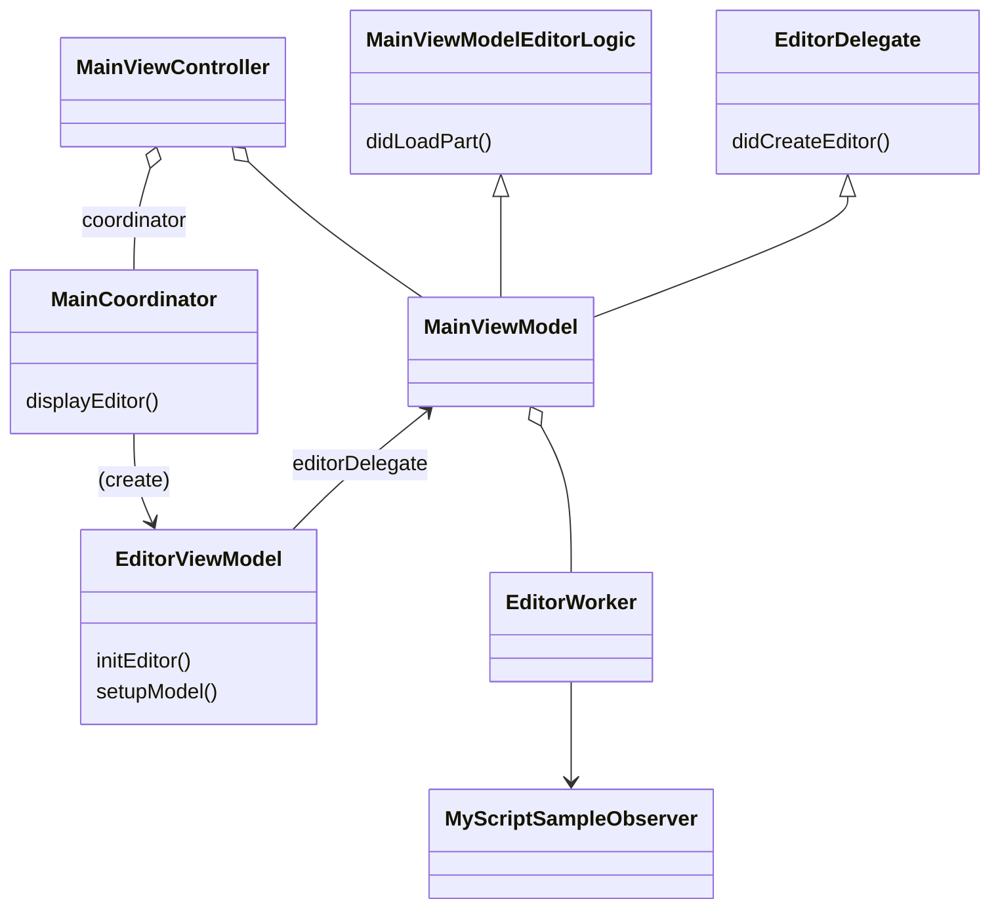
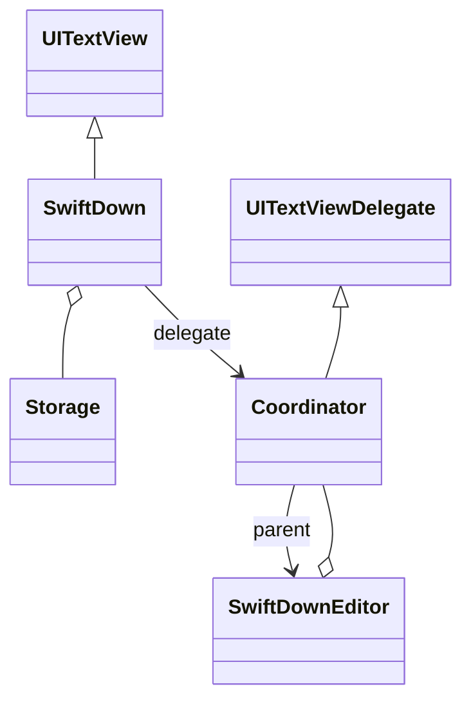
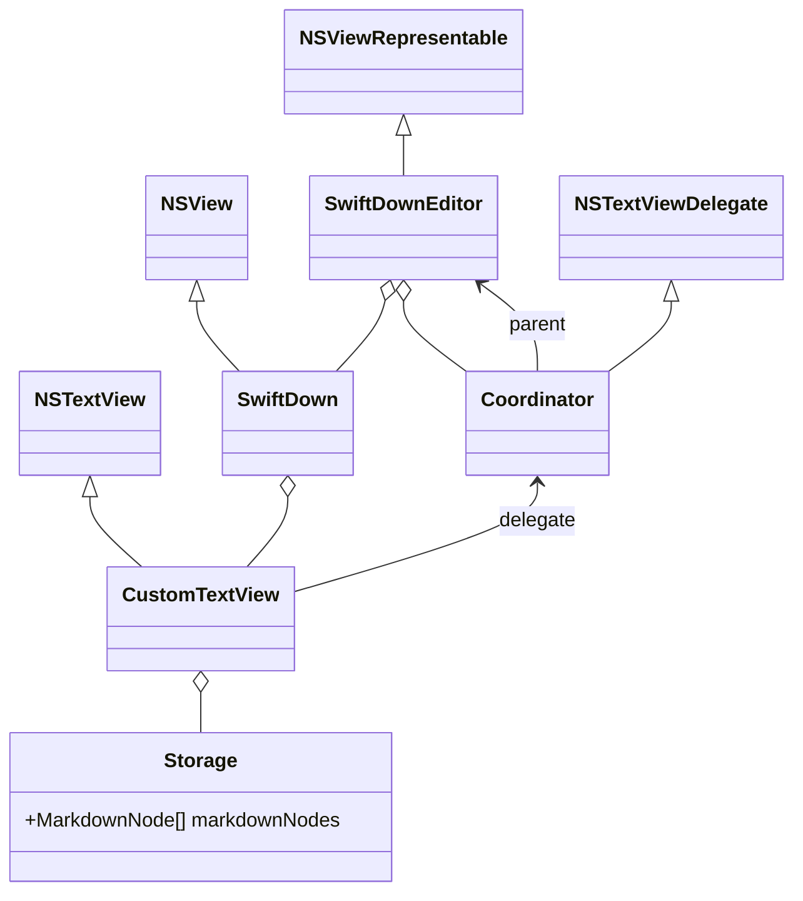

#  Markdown Math

## Build

I'll assume the myscript version is 2.0.1.

Download [MyScriptInteractiveInk-Runtime-iOS](https://s3-us-west-2.amazonaws.com/iink/runtime/2.0.0/MyScriptInteractiveInk-Runtime-iOS-2.0.1.zip) and unzip at the project root.

Place `ingun.markdown-math.c` that is sent you by email under MyCertificate/ folder.

The version is fixed to 2.0.1 in the script.

## Linting

Use [SwiftLint](https://github.com/realm/SwiftLint).

```shell
# install
brew install swiftlint

# run
swiftlint --fix --strict markdown-math/*.swift
```

## How to run MyScript Examples on your iPad

- Change the sample's bundle identifier to `ingun.markdown-math`.
- Copy the contents of `/MyCertificate/ingun.markdown-math.c` and paste to `.../MyCertificate.c`

## Implement MyScript Demo

Download sample from [myscript/interactive-ink-examples-ios](https://github.com/myscript/interactive-ink-examples-ios).

Import [Demo](https://github.com/MyScript/interactive-ink-examples-ios/tree/master/Examples/Demo/Demo) and [Frameworks](https://github.com/MyScript/interactive-ink-examples-ios/tree/master/Examples/Frameworks/) to project. Choose *Create groups* when adding the folders.

Make some changes.

### Header search path

Add `${SRCROOT}/Frameworks` or wherever the `Frameworks` folder is to  Header Search Paths as recursive.

### Remove conflicting project data

Remove `Demo/Supporting Files/` and `Demo/Classe/Utils/AppDelegate.swift` and `Demo/MyCertificate/`

### Change Prev and Next to Cancel and Done

In `Main.storyboard`, change the Prev and Next at the bottom toolbar to Cancel and Done by setting `System Item`. Remove + button.

In `MainViewModel`, set default value of `previousButtonEnabled` and `nextButtonEnabled` to true. It has to remain true and never change so search for all their usages and delete.

Remove + button at the bottom toolbar and `addPartBarButtonItem` and their usages from `MainViewController`.

### Notify Done and Cancel

In `EditorWorker.swift`, Call `MyScriptSampleObserver.done(tex: String)` and `MyScriptSampleObserver.cancel()` from `func loadNextPart()` and `func loadPreviousPart()` respectively.

```swift
    func loadNextPart() {
        if let editor = self.editor,
           let part = editor.part{
            let type = part.type
            editor.waitForIdle() // Waits until part modification operations are over.
            if let aaa = try? editor.export(selection: editor.rootBlock,
                                        mimeType: IINKMimeType.laTeX
            ) {
                MyScriptSampleObserver.shared().delegate?.done(tex: aaa)
            }
        }
    }

    func loadPreviousPart() {
        MyScriptSampleObserver.shared().delegate?.cancel()
    }
```

### Import LaTex to editor

In `MainViewModel`, append following code to `didLoadPart()`

```swift
    func didLoadPart(title: String, index: Int, partCount: Int) {
        // ...
        if let editor = self.editor, let tex = MyScriptSampleObserver.shared().latex {
            try? editor.import(mimeType: IINKMimeType.laTeX, data: tex, selection: editor.rootBlock)
        }
    }
```

### Bundle Resources

Go to project setting > Build Phases > Copy Bundle Resources and add `.../recognition-assets` as folder.

Remove all the individual files under recognition-assets added by adding `Demo` folder before.


### Import Swift into ObjC

In `SmartGuideViewController.mm`, change Swift module import header to `#import "markdown_math-Swift.h"`

### Remevo redundant UI components

In `Demo/Clasess/Scenes/Main.storyboard`, remove Navigation Item > Right Bar Button Items > More Bar Button Item.
In `Demo/Classes/Scenes/Toolbar/Toolbar.storyboard`, remove Highlighter and Style button.

### Diagram



## SwiftDown

### iOS



### MacOS


